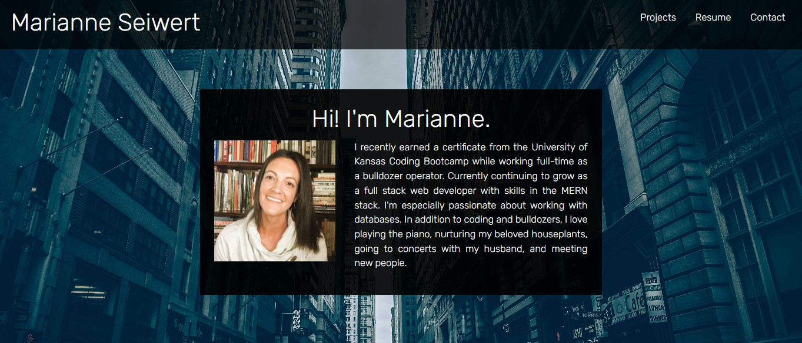

# Portfolio

## Refactor of my portfolio using React
Here's a link to my deployed portfolio:
https://penelopeundercover.github.io/Portfolio/

The first version of my portfolio was built simply with HTML and CSS. This refactor is my first React project, and I learned a lot while building it!

I handled navigation between pages with React Router. Overall it was pretty easy to use.

Most of my styling was done by agonizing over CSS for extended periods of time. It was both frustrating and rewarding. I found an odd enjoyment in the frustration. 
I used Bootstrap on the Projects page. While I definitely improved my CSS skills, in future it might better serve to use Bootstrap more, particularly when it comes to responsiveness. Much of my custom CSS would have looked just as good and taken me half as long had I used more Bootstrap. 

The Contact page was fun and easy. I used React Icons and some cute CSS elements. A cheerful little confidence-booster in the midst of more challenging aspects in the construction of this project.

The most challenging page for me ended up being the Resume page. At first I simply displayed my resume as an image. But that was kind of boring. Then I tried a React PDF npm. It was ok--perhaps a bit clunky for my purposes--but didn't offer download or print options. And then I discovered iFrames! I was pretty excited about the iFrame because it offered the functionality I wanted, and required very little styling. Unfortunately, as I came to discover, it's not very responsive in some browsers. It looked atrocious on Safari! So for now I've changed it back to an image. Boring, but it looks good, and I already spent way too much time on this one element.

For the Homepage, I decided I wanted my bio box to fade in the very first time a user visits the page, and then not do that anymore, and I found that it was a more complicated task than I expected. I got some help with it, and learned useState and useEffect. How handy! I also used these hooks for the hamburger menu that replaces the navbar in smaller viewports.

For now I'm simply using Github Pages to host. I'll probably deploy with an additional hosting service soon. 
Another future development plan is to explore accessibility and SEO, implement what I learn into this project, and see what happens!
